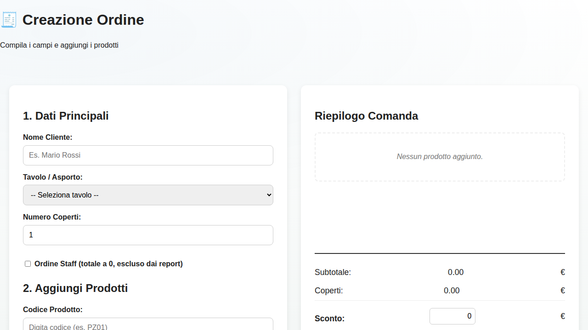

# RICEVUTE — Web App Gestionale per Ristorante

Sistema completo per la gestione degli ordini in ristorazione: inserimento ordini dalla cassa, invio comande alle stampanti di reparto, report giornalieri e pannello amministrativo.

## 📚 Documentation

### 🌟 **User Guides - [WIKI](wiki/)**

**Start here if you're new to the system!**

- **[How to Create an Order](wiki/How-to-Create-an-Order.md)** - Complete guide for all order types:
  - ✅ Normal customer orders
  - ✅ Staff orders (zero cost, excluded from reports)
  - ✅ Orders with discounts
  - Includes screenshots, examples, and troubleshooting

### 📖 Technical Documentation

- [Full Documentation](docs/README.md) - Complete technical documentation
- [API Documentation](docs/API.md) - REST API endpoints and responses
- [Installation Guide](docs/INSTALL.md) - Setup and configuration
- [Repository Structure](STRUCTURE.md) - Project organization
- [Pages Overview](docs/PAGINE_WEB.md) - Screenshots and explanations

## 🚀 Quick Start

1. **Clone the repository**
   ```bash
   git clone https://github.com/AlexMaina05/RICEVUTE.git
   ```

2. **Set up the database**
   ```bash
   mysql -u root -p
   CREATE DATABASE ristorante_db CHARACTER SET utf8mb4 COLLATE utf8mb4_unicode_ci;
   mysql -u app_user -p ristorante_db < sql/schema.sql
   ```

3. **Configure database connection** in `config/db_connection.php`

4. **Access the application** at `http://your-server/RICEVUTE/public`

For detailed installation instructions, see [INSTALL.md](docs/INSTALL.md)

## ✨ Key Features

- **Order Management**: Create orders with real-time product lookup
- **Staff Orders**: Track staff meals separately (zero cost, excluded from reports)
- **Discount Support**: Apply discounts to customer orders
- **Department Printing**: Automatic receipt generation for kitchen, bar, and other departments
- **Daily Reports**: Revenue and sales statistics with PDF export
- **Admin Panel**: Manage products, tables, categories, and departments

## 🖼️ Screenshots


*Order creation interface*

More screenshots available in [docs/screenshots/](docs/screenshots/)

## 🎯 Main Pages

- **[Cassa (Cash Register)](public/cassa.php)** - Create and manage orders
- **[Reports](public/report.php)** - View daily sales and statistics
- **[Admin Panel](public/admin.php)** - Manage system data
- **[Login](public/login.php)** - User authentication

## 🛠️ Technology Stack

- **Frontend**: HTML, CSS, JavaScript
- **Backend**: PHP 8.0+
- **Database**: MySQL/MariaDB
- **Printing**: CUPS integration for receipt printing
- **API**: REST JSON endpoints

## 📋 API Overview

All APIs return standardized JSON responses:

```json
{
  "success": true|false,
  "data": {...},
  "error": {...}
}
```

Main endpoints:
- `GET /api/cerca_prodotto.php?codice=CODE` - Search products
- `POST /api/salva_ordine.php` - Create new order
- `GET /api/genera_report.php?data=YYYY-MM-DD` - Generate reports

See [API Documentation](docs/API.md) for complete details.

## 🔒 Security

- HTTPS recommended for production
- Password hashing with PHP `password_hash()`
- Prepared statements for SQL injection prevention
- Input validation on all endpoints
- Session management with secure flags

## 📞 Support

- **User Guides**: Check the [Wiki](wiki/) first
- **Issues**: Open an issue on GitHub
- **Documentation**: Browse [docs/](docs/)

## 📄 License

See [LICENSE](LICENSE) file for details.

## 👤 Author

Alessandro Mainardi (AlexMaina05)

---

**New Users**: Start with the [How to Create an Order](wiki/How-to-Create-an-Order.md) guide!
