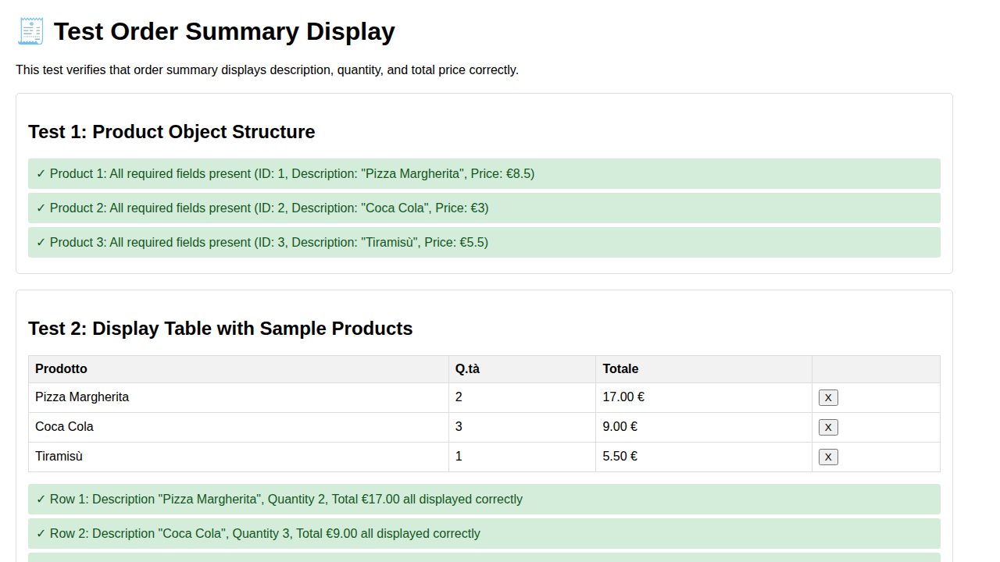
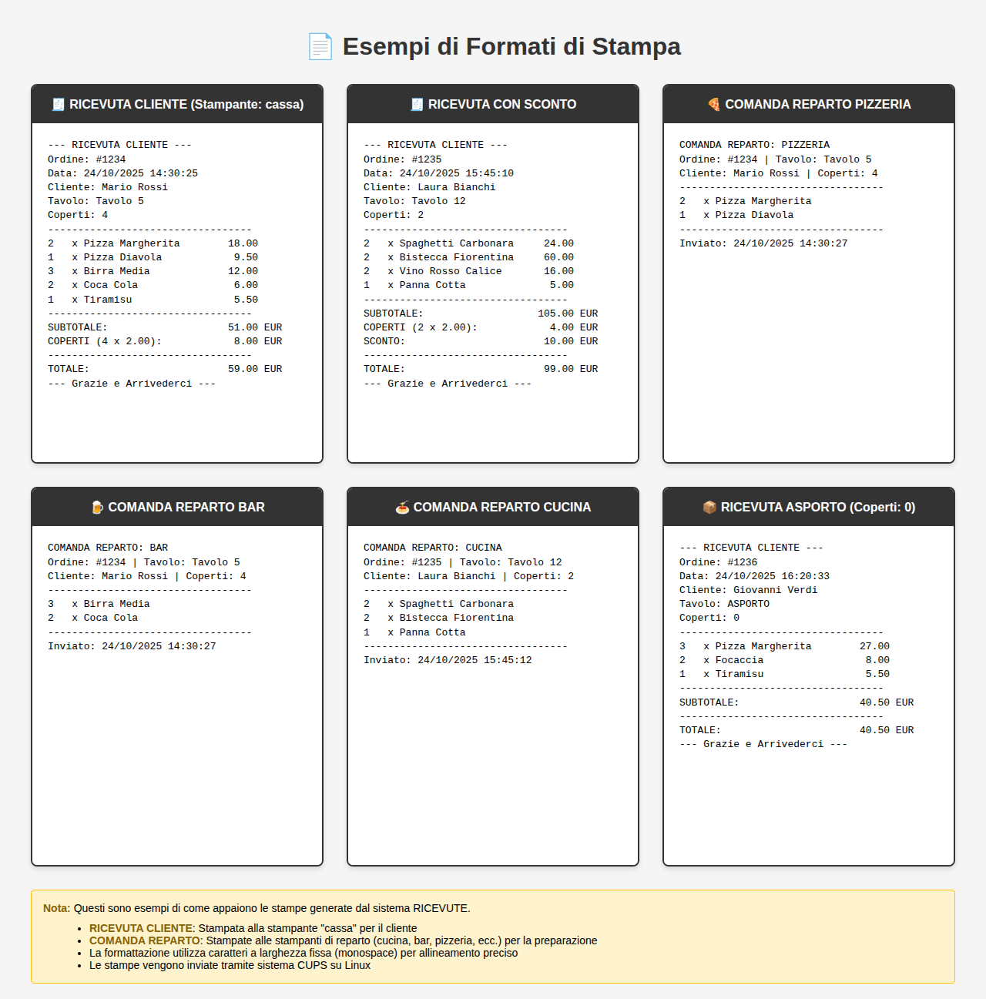

# Documentazione Pagine Web - RICEVUTE

Questo documento fornisce una panoramica completa di tutte le pagine web disponibili nell'applicazione RICEVUTE, con screenshot e spiegazioni dettagliate del funzionamento di ciascuna.

## Indice

1. [Pagina Home (index.html)](#1-pagina-home-indexhtml)
2. [Pagina Login (login.php)](#2-pagina-login-loginphp)
3. [Pagina Creazione Ordini - Cassa (cassa.php)](#3-pagina-creazione-ordini---cassa-cassaphp)
4. [Pagina Report Vendite (report.php)](#4-pagina-report-vendite-reportphp)
5. [Pagina Manutenzione - Admin (admin.php)](#5-pagina-manutenzione---admin-adminphp)
6. [Sezione Test](#6-sezione-test)
7. [Formati di Stampa](#7-formati-di-stampa)

---

## 1. Pagina Home (index.html)

### Screenshot


### Descrizione
La pagina home è il punto di ingresso principale dell'applicazione. Presenta un'interfaccia moderna e pulita con tre card principali che permettono di navigare verso le diverse sezioni del gestionale.

### Funzionalità
- **Navigazione principale**: Fornisce accesso rapido alle tre sezioni principali dell'applicazione
- **Design responsive**: Si adatta a diversi dispositivi e dimensioni dello schermo
- **Interfaccia utente moderna**: Utilizza card colorate per una migliore esperienza utente

### Sezioni disponibili:

#### 🧾 Creazione Ricevute
- **Link**: `cassa.php`
- **Descrizione**: Accesso alla sezione cassa per creare nuove comande
- **Colore distintivo**: Azzurro/Ciano
- **Utenti**: Accessibile a tutti gli operatori

#### 📈 Controllo Dati
- **Link**: `report.php`
- **Descrizione**: Visualizzazione di report di vendite e statistiche
- **Colore distintivo**: Verde
- **Utenti**: Accessibile a tutti gli operatori

#### ⚙️ Manutenzione
- **Link**: `admin.php`
- **Descrizione**: Gestione di prodotti, reparti e impostazioni del sistema
- **Colore distintivo**: Arancione
- **Utenti**: **Richiede autenticazione admin**
- **Nota**: Cliccando su questa sezione, si viene reindirizzati alla pagina di login

### Elementi UI
- **Header**: Titolo "Gestionale Comande Brés&Baràca" con sottotitolo
- **Footer**: Copyright con anno corrente e link al profilo GitHub dell'autore
- **Font**: Utilizza Poppins da Google Fonts per un aspetto moderno

---

## 2. Pagina Login (login.php)

### Screenshot


### Descrizione
La pagina di login protegge l'accesso all'area riservata (Manutenzione/Admin). Presenta un'interfaccia pulita e minimalista centrata sulla schermata.

### Funzionalità
- **Autenticazione**: Verifica la password per accedere all'area admin
- **Gestione sessione**: Utilizza le sessioni PHP per mantenere lo stato di login
- **Messaggi di errore**: Mostra feedback visivo in caso di password errata
- **Accessibilità**: Utilizza attributi ARIA per migliorare l'esperienza degli utenti con screen reader

### Elementi del Form
1. **Campo Password**: Input protetto per l'inserimento della password
   - Tipo: `password`
   - Attributo: `required`, `autofocus`
   - La password viene verificata tramite `check_login.php`

2. **Pulsante "Accedi"**: Submit del form
   - Invia i dati a `check_login.php` via POST
   - Stile primario blu

3. **Link "Torna alla Home"**: Permette di tornare alla pagina principale
   - Link diretto a `index.html`

### Sicurezza
- Le sessioni PHP vengono avviate all'inizio della pagina
- I messaggi di errore vengono sanificati con `htmlspecialchars()` per prevenire XSS
- La password viene verificata server-side in `check_login.php`
- Dopo il login, la sessione viene marcata con `$_SESSION['loggedin'] = true`

### Flusso di Autenticazione
1. L'utente inserisce la password
2. Il form viene inviato a `check_login.php` via POST
3. Se la password è corretta, viene creata una sessione e l'utente viene reindirizzato ad `admin.php`
4. Se la password è errata, viene mostrato un messaggio di errore e l'utente rimane sulla pagina di login

---

## 3. Pagina Creazione Ordini - Cassa (cassa.php)

### Screenshot


### Descrizione
La pagina cassa è lo strumento principale per gli operatori che devono prendere ordini dai clienti e creare comande da inviare ai reparti di cucina.

### Funzionalità Principali

#### Sezione 1: Dati Principali
Raccoglie le informazioni di base dell'ordine:

1. **Nome Cliente**
   - Campo di testo libero
   - Esempio: "Mario Rossi"
   - Obbligatorio

2. **Tavolo / Asporto**
   - Menu a tendina che carica dinamicamente i tavoli dal database (tabella `TAVOLI`)
   - Include opzioni per tavoli in sala e asporto
   - Quando si seleziona "ASPORTO", il campo coperti viene automaticamente impostato a 0 e disabilitato
   - Obbligatorio

3. **Numero Coperti**
   - Campo numerico
   - Valore minimo: 0
   - Valore predefinito: 1
   - Viene automaticamente gestito in base al tipo di servizio (SALA/ASPORTO)

#### Sezione 2: Aggiungi Prodotti
Permette di aggiungere prodotti all'ordine:

1. **Codice Prodotto**
   - Input di testo per inserire il codice prodotto
   - Es: "PZ01" per una pizza
   - Il sistema cerca il prodotto nel database tramite API `api/cerca_prodotto.php`
   - Feedback immediato se il prodotto non esiste

2. **Quantità**
   - Campo numerico
   - Valore minimo: 1
   - Valore predefinito: 1

3. **Pulsante "Aggiungi Prodotto"**
   - Verifica l'esistenza del prodotto
   - Aggiunge il prodotto alla tabella riepilogo
   - Aggiorna il totale dell'ordine

#### Sezione 3: Riepilogo Comanda
Mostra tutti i prodotti aggiunti all'ordine:

- **Tabella prodotti**: Visualizza descrizione, quantità, prezzo unitario per ogni prodotto
- **Azioni per riga**: Pulsante per rimuovere singoli prodotti
- **Totale ordine**: Calcolo automatico e in tempo reale del totale
- **Pulsante "Salva e Stampa Comande"**: 
  - Salva l'ordine nel database (tabella `ORDINI` e `DETTAGLI_ORDINE`)
  - Crea automaticamente le comande per i vari reparti (tabella `COMANDE`)
  - Utilizza l'API `api/salva_ordine.php`
  - Le comande vengono poi inviate alle stampanti tramite il worker CLI

### Interazioni JavaScript (cassa.js)
- Ricerca prodotti in tempo reale
- Validazione lato client dei dati
- Gestione dinamica della tabella riepilogo
- Calcolo automatico del totale
- Gestione automatica del campo coperti per ordini ASPORTO

### Gestione Errori
- Se il database non è raggiungibile, mostra un messaggio di errore invece del form
- Validazione dei campi obbligatori
- Feedback visivo per prodotti non trovati
- Link per tornare al menu principale sempre disponibile

### Sicurezza
- Content Security Policy in modalità report-only
- Sanificazione di tutti gli output con `htmlspecialchars()`
- Prepared statements per query al database
- Validazione lato client e server

---

## 4. Pagina Report Vendite (report.php)

### Screenshot


### Descrizione
La pagina report permette di visualizzare e analizzare le vendite per data, generare report dettagliati e esportarli in formato PDF.

### Funzionalità Principali

#### Sezione Filtri Report
Permette di selezionare il periodo da analizzare:

1. **Selezione Rapida**
   - Menu a tendina con le ultime 14 date
   - "Oggi" è preselezionato per impostazione predefinita
   - Include la data formattata (es: "23/10/2025")
   - Opzione "-- Personalizza --" per utilizzare il selettore data personalizzato

2. **Selettore Data Personalizzato**
   - Input di tipo `date` per selezionare qualsiasi data
   - Formato: YYYY-MM-DD
   - Utile per consultare dati storici oltre le 14 date rapide

3. **Pulsanti di Azione**:
   - **Genera Report**: Carica i dati per la data selezionata
   - **🖨️ Stampa**: Apre la finestra di stampa del browser
   - **⬇️ Scarica PDF**: Esporta il report in formato PDF (client-side con html2pdf.js)

#### Sezione Risultati
Viene mostrata dopo aver generato un report:

1. **Header del Report**
   - Mostra la data analizzata
   - Formato: "Riepilogo del DD/MM/YYYY"

2. **Contenuto Report** (caricato dinamicamente via API)
   - **Riepilogo generale**:
     - Numero totale ordini
     - Totale venduto (€)
     - Numero totale coperti
     - Scontrino medio
   
   - **Dettaglio prodotti venduti**:
     - Elenco di tutti i prodotti venduti
     - Per ogni prodotto: descrizione, quantità totale venduta, incasso totale
     - Ordinamento per categoria/reparto
   
   - **Grafici e statistiche** (se implementati):
     - Distribuzione vendite per categoria
     - Prodotti più venduti
     - Andamento orario

3. **Messaggi di stato**:
   - **Caricamento**: Spinner o messaggio durante il fetch dei dati
   - **Nessun dato**: Messaggio se non ci sono vendite per la data selezionata

### Interazioni JavaScript (report.js)
- Chiamata AJAX all'API `api/genera_report.php` o `api/gestisci_dati.php`
- Sincronizzazione tra selettore rapido e data personalizzata
- Gestione dello stato dei pulsanti (abilitati solo dopo aver generato il report)
- Generazione PDF lato client con html2pdf.js
- Formattazione valute e numeri

### Export e Stampa
- **Stampa**: Utilizza CSS print-friendly per nascondere elementi non necessari
- **PDF**: Utilizza la libreria html2pdf.js (CDN) per conversione client-side
  - Non richiede elaborazione server
  - Mantiene formattazione e stili
  - Nome file suggerito: report_YYYY-MM-DD.pdf

### API Utilizzate
- `api/genera_report.php?data=YYYY-MM-DD`: Restituisce dati aggregati per la data
- `api/gestisci_dati.php?data=YYYY-MM-DD`: Restituisce dati dettagliati per report completo

### Sicurezza
- Content Security Policy per controllare risorse esterne
- Validazione delle date lato client e server
- Sanificazione output HTML
- CORS configurato per CDN html2pdf.js

---

## 5. Pagina Manutenzione - Admin (admin.php)

### Screenshot


### Descrizione
La pagina admin è l'area riservata per la gestione delle anagrafiche e delle impostazioni del sistema. **Richiede autenticazione** tramite la pagina login.php.

### Controllo Accessi
- All'apertura della pagina, viene verificata la presenza di `$_SESSION['loggedin']`
- Se l'utente non è autenticato, viene reindirizzato automaticamente a `login.php`
- Include un pulsante "Esci (Logout)" per terminare la sessione

### Struttura a Tab
L'interfaccia è organizzata in 5 schede principali:

#### Tab 1: 📦 Prodotti Menu
Gestisce l'anagrafica dei prodotti del menu:

**Funzionalità:**
- Visualizzazione tabella prodotti con colonne:
  - ID (auto-incrementale)
  - Codice Prodotto (es: "PZ01", "BP02")
  - Descrizione (es: "Pizza Margherita")
  - Prezzo (formato decimale €)
  - Azioni (Modifica/Elimina)

- **+ Aggiungi Nuovo Prodotto**: Apre modal per inserimento
  - Codice Prodotto (univoco, max 191 caratteri)
  - Descrizione (max 255 caratteri)
  - Prezzo (decimale con 2 cifre)
  - Categoria (FK a CATEGORIE)
  - Reparto (FK a REPARTI - determina dove viene stampata la comanda)

- **Modifica**: Apre modal pre-popolato con i dati attuali
- **Elimina**: Richiede conferma, elimina il prodotto (se non referenziato in ordini)

**Vincoli:**
- Il Codice Prodotto deve essere univoco
- Categoria e Reparto devono esistere nelle rispettive tabelle
- L'eliminazione è bloccata se il prodotto è presente in ordini esistenti (RESTRICT)

#### Tab 2: 🍽️ Tavoli
Gestisce l'anagrafica dei tavoli e servizi:

**Funzionalità:**
- Visualizzazione tabella tavoli:
  - ID
  - Nome Tavolo (es: "Tavolo 1", "Asporto")
  - Tipo Servizio (SALA o ASPORTO)
  - Azioni

- **+ Aggiungi Nuovo Tavolo**: Modal per inserimento
  - Nome Tavolo (max 150 caratteri)
  - Tipo Servizio (dropdown: SALA/ASPORTO)

- **Modifica/Elimina**: Funzioni standard con validazione

**Note:**
- I tavoli ASPORTO impostano automaticamente i coperti a 0 in cassa.php
- L'eliminazione è bloccata se il tavolo ha ordini associati

#### Tab 3: 🏷️ Categorie
Gestisce le categorie dei prodotti:

**Funzionalità:**
- Visualizzazione tabella categorie:
  - ID
  - Nome Categoria (es: "Pizze", "Bevande", "Dolci")
  - Azioni

- **+ Aggiungi Nuova Categoria**: Modal per inserimento
  - Nome Categoria (max 150 caratteri)

- **Modifica/Elimina**: Con validazione referenziale

**Uso:**
- Le categorie servono per organizzare i prodotti
- Utilizzate nei report per aggregare le vendite
- Non influenzano la logica di stampa (quella dipende dai Reparti)

#### Tab 4: 🖨️ Reparti Stampa
Gestisce i reparti e le stampanti associate:

**Funzionalità:**
- Visualizzazione tabella reparti:
  - ID
  - Nome Reparto (es: "Cucina", "Bar", "Pizzeria")
  - Nome Stampante di Rete (es: "CUPS_printer_cucina")
  - Azioni

- **+ Aggiungi Nuovo Reparto**: Modal per inserimento
  - Nome Reparto (max 150 caratteri)
  - Nome Stampante LAN (max 150 caratteri)

**Concetto chiave:**
- Ogni prodotto è associato a un reparto
- Quando viene salvato un ordine, vengono create comande separate per ogni reparto coinvolto
- Il campo "Nome Stampante LAN" viene utilizzato dal worker CLI (`scripts/worker_process_comande.php`) per inviare le comande alle stampanti CUPS corrette
- Esempio: 
  - Un ordine con pizza → comanda alla stampante "pizzeria"
  - Un ordine con birra → comanda alla stampante "bar"
  - Un ordine misto → comande separate a entrambe le stampanti

#### Tab 5: 📦 Export / Backup
Strumenti per esportare e fare backup dei dati:

**Funzionalità:**
- Export in formato **CSV** (per Excel/LibreOffice):
  - Encoding UTF-8 con BOM
  - Separatore: virgola
  - Intestazioni incluse
  
- Export in formato **SQL** (per reimport su database):
  - Istruzioni INSERT pronte all'uso
  - Compatibile MySQL/MariaDB
  - Utile per backup o migrazione

**Tabelle esportabili:**
1. **Prodotti**: Anagrafica menu completa
2. **Ordini**: Storico ordini con testata
3. **Comande**: Storico comande inviate alle stampanti

**Pulsanti:**
- "📄 Scarica CSV": Download immediato del file CSV
- "💾 Scarica SQL": Download immediato del file SQL

**Implementazione:**
- Export lato server via `api/esporta_dati.php` o endpoint dedicato
- Streaming dei dati per gestire tabelle grandi senza timeout
- Documentazione completa in `docs/EXPORT.md`

### Interazioni JavaScript (admin.js)
Il file `admin.js` gestisce:
- Sistema di tab per navigazione tra sezioni
- Apertura/chiusura modal per CRUD operations
- Caricamento dinamico dati nelle tabelle via AJAX
- Validazione form lato client
- Conferme per eliminazioni
- Refresh delle tabelle dopo modifiche
- Gestione export (trigger download)

### Modal di Editing
Modale dinamico (`#edit-modal`) utilizzato per tutte le operazioni CRUD:
- **Titolo dinamico**: "Aggiungi X" o "Modifica X"
- **Corpo dinamico**: Campi form generati in base al tipo di entità
- **Campo nascosto**: ID per operazioni di modifica
- **Pulsante salva**: Invia dati all'API appropriata

### API Utilizzate
- `api/gestisci_dati.php`: API unificata per operazioni CRUD
  - GET: Elenco entità
  - POST: Creazione
  - PUT: Modifica
  - DELETE: Eliminazione
- Parametri: `tipo` (prodotto/tavolo/categoria/reparto), `id`, dati JSON nel body

### Sicurezza
- Verifica sessione all'inizio di ogni request
- Content Security Policy in report-only mode
- Prepared statements per tutte le query
- Validazione input lato client e server
- Sanificazione output HTML
- Vincoli referenziali nel database per integrità dati

### Pulsanti di Navigazione
- **← Torna al menu principale**: Link a `index.html`
- **Esci (Logout)**: Link a `logout.php` che distrugge la sessione

### Gestione Errori
- Se il database non è raggiungibile, mostra error box invece delle tab
- Messaggi di errore user-friendly per operazioni fallite
- Log dettagliati server-side per debugging

---

## Note Tecniche Generali

### Stack Tecnologico
- **Frontend**: HTML5, CSS3, JavaScript vanilla
- **Backend**: PHP 8.0+
- **Database**: MySQL/MariaDB con charset utf8mb4
- **Worker**: Script CLI PHP per elaborazione comande
- **Stampa**: CUPS (Common Unix Printing System)

### File CSS Principali
- `style_home.css`: Stili per la homepage
- `style.css`: Stili globali per tutte le altre pagine
- Design moderno con card, gradient e ombre
- Responsive per dispositivi mobili

### Convenzioni
- Tutte le pagine PHP includono `db_connection.php` per accesso DB
- Le API restituiscono JSON con schema uniforme: `{success, data, error}`
- Le date sono in formato italiano (DD/MM/YYYY) nel frontend, ISO (YYYY-MM-DD) nel backend
- Encoding consistente: UTF-8 in tutto lo stack

### Riferimenti Documentazione
- `docs/README.md`: Documentazione generale del progetto
- `docs/API.md`: Documentazione completa delle API REST
- `docs/INSTALL.md`: Guida all'installazione
- `docs/EXPORT.md`: Dettagli sulla funzionalità di export
- `summary/SECURITY_SUMMARY.md`: Note sulla sicurezza

---

## 6. Sezione Test

### Screenshot



### Descrizione

La sezione test contiene pagine HTML dedicate alla verifica del corretto funzionamento delle funzionalità dell'applicazione. Questi test sono fondamentali per garantire la qualità del codice e la correttezza dei calcoli.

### Test Disponibili

#### Test Order Summary Display (test_order_summary.html)

Questo test verifica che la visualizzazione del riepilogo ordini funzioni correttamente:

**Test 1: Struttura Oggetto Prodotto**
- Verifica che tutti i prodotti abbiano i campi richiesti (ID, Descrizione, Prezzo)
- Controlla la presenza di tutte le proprietà necessarie
- Valida il formato dei dati

**Test 2: Tabella di Visualizzazione**
- Verifica la corretta visualizzazione dei prodotti nella tabella riepilogo
- Controlla che descrizione, quantità e totale siano mostrati correttamente
- Valida la formattazione dei prezzi (con simbolo € e 2 decimali)
- Testa la presenza dei pulsanti di rimozione per ogni riga

**Test 3: Verifica dei Calcoli**
- Test delle moltiplicazioni: Prezzo × Quantità = Totale
- Verifica con diverse combinazioni:
  - €8.5 × 2 = €17.00
  - €3 × 3 = €9.00
  - €5.5 × 1 = €5.50
  - €10 × 0 = €0.00 (edge case)
  - €0 × 5 = €0.00 (edge case)

**Risultati:**
- **Total Tests**: 11
- **Passed**: 11
- **Failed**: 0
- **Result**: ✓ All tests passed!

### Esecuzione dei Test

I test possono essere eseguiti in diversi modi:

#### 1. Test HTML Interattivi
Aprire i file HTML nel browser per eseguire test automatici client-side:
```
http://your-server/tools/tests/test_order_summary.html
```

Sostituire `your-server` con il dominio o indirizzo del proprio server (es. `localhost:8080`, `192.168.1.100`, ecc.).

#### 2. Test API con Shell Scripts
Eseguire gli script bash per testare le API REST:

```bash
# Test semplici della classe ApiResponse
bash tools/tests/test_api_response_simple.sh

# Test di integrazione API (sostituire BASE_URL con il proprio server)
bash tools/tests/api_responses_test.sh http://your-server/RICEVUTE

# Smoke test manuali (sostituire BASE_URL con il proprio server)
bash tools/tests/test_api_responses.sh http://your-server/RICEVUTE
```

#### 3. Test PHP Standalone
Eseguire test PHP per verificare la logica backend:

```bash
# Test export API
php tools/tests/test_export_api.php

# Test formato risposte API
php tools/tests/test_api_response.php
```

### Copertura Test

I test coprono le seguenti aree:

1. **Logica di Business**
   - Calcoli totali ordini
   - Formattazione prezzi
   - Gestione quantità

2. **Interfaccia Utente**
   - Visualizzazione corretta dei dati
   - Formattazione valute
   - Interazione con elementi DOM

3. **API REST**
   - Formato risposte standardizzato
   - Gestione errori
   - Validazione parametri
   - Codici HTTP corretti

4. **Export e Backup**
   - Generazione CSV
   - Generazione SQL
   - Integrità dei dati esportati

### Integrazione Continua

Per garantire la qualità del codice:

1. **Prima di committare**: Eseguire tutti i test per verificare che non ci siano regressioni
2. **Dopo modifiche**: Eseguire i test relativi alle aree modificate
3. **Deploy**: Eseguire l'intera suite di test prima di mettere in produzione

### Documentazione Test

Per maggiori dettagli sulla suite di test:
- `tools/tests/README.md`: Documentazione completa dei test API
- `docs/API.md`: Specifica delle API e codici di errore
- `summary/SECURITY_SUMMARY.md`: Test di sicurezza e validazione

---

## 7. Formati di Stampa

### Screenshot Completo



### Descrizione

Il sistema RICEVUTE genera automaticamente due tipi principali di stampe quando viene salvato un ordine. Queste stampe vengono inviate a stampanti CUPS configurate nel sistema.

### Tipi di Stampa

#### 🧾 RICEVUTA CLIENTE


**Destinazione**: Stampante "cassa" (configurata come default)

**Scopo**: Ricevuta per il cliente con il dettaglio completo dell'ordine

**Contenuto**:
- Numero ordine progressivo
- Data e ora
- Nome cliente
- Tavolo
- Numero coperti
- Lista prodotti con quantità e prezzi
- Subtotale prodotti
- Costo coperti (se applicabile)
- Sconto (se applicato)
- Totale finale

**Formattazione**:
- Font monospace (Courier New) per allineamento preciso
- Larghezza fissa di 38 caratteri
- Separatori visuali con trattini
- Prezzi allineati a destra con 2 decimali
- Valuta in EUR

**Esempio**:
```
--- RICEVUTA CLIENTE ---
Ordine: #1234
Data: 24/10/2025 14:30:25
Cliente: Mario Rossi
Tavolo: Tavolo 5
Coperti: 4
----------------------------------
2   x Pizza Margherita        18.00
1   x Pizza Diavola            9.50
3   x Birra Media             12.00
----------------------------------
SUBTOTALE:                    51.00 EUR
COPERTI (4 x 2.00):            8.00 EUR
----------------------------------
TOTALE:                       59.00 EUR
--- Grazie e Arrivederci ---
```

#### 🧾 RICEVUTA CON SCONTO


Quando viene applicato uno sconto all'ordine, la ricevuta include una riga aggiuntiva che mostra l'importo dello sconto prima del totale finale.

**Esempio**:
```
----------------------------------
SUBTOTALE:                   105.00 EUR
COPERTI (2 x 2.00):            4.00 EUR
SCONTO:                       10.00 EUR
----------------------------------
TOTALE:                       99.00 EUR
```

#### 🍕 COMANDA REPARTO


**Destinazione**: Stampanti di reparto (configurate in tabella REPARTI)

**Scopo**: Comunicare ai reparti (cucina, pizzeria, bar, ecc.) quali prodotti preparare

**Contenuto**:
- Nome reparto in maiuscolo
- Numero ordine
- Tavolo
- Cliente
- Numero coperti
- Lista prodotti del reparto con quantità
- Data e ora di invio

**Logica di Creazione**:
- Un ordine può generare più comande, una per ogni reparto coinvolto
- I prodotti vengono raggruppati automaticamente per reparto in base alla configurazione
- Ogni comanda viene inviata solo alla stampante del reparto corrispondente

**Esempio Pizzeria**:
```
COMANDA REPARTO: PIZZERIA
Ordine: #1234 | Tavolo: Tavolo 5
Cliente: Mario Rossi | Coperti: 4
----------------------------------
2   x Pizza Margherita
1   x Pizza Diavola
----------------------------------
Inviato: 24/10/2025 14:30:27
```

**Esempio Bar**:
```
COMANDA REPARTO: BAR
Ordine: #1234 | Tavolo: Tavolo 5
Cliente: Mario Rossi | Coperti: 4
----------------------------------
3   x Birra Media
2   x Coca Cola
----------------------------------
Inviato: 24/10/2025 14:30:27
```

**Esempio Cucina**:
```
COMANDA REPARTO: CUCINA
Ordine: #1235 | Tavolo: Tavolo 12
Cliente: Laura Bianchi | Coperti: 2
----------------------------------
2   x Spaghetti Carbonara
2   x Bistecca Fiorentina
1   x Panna Cotta
----------------------------------
Inviato: 24/10/2025 15:45:12
```

### Processo di Stampa

1. **Salvataggio Ordine**: Quando l'operatore salva un ordine da `cassa.php`, l'API `api/salva_ordine.php` viene invocata

2. **Transazione Database**: L'ordine viene salvato nelle tabelle `ORDINI` e `DETTAGLI_ORDINE`

3. **Generazione Ricevuta**: 
   - Viene generato il testo della ricevuta cliente
   - Viene inviato alla stampante "cassa" tramite comando CUPS `lp`
   - Se la stampa fallisce, l'ordine viene comunque salvato (log dell'errore)

4. **Generazione Comande**:
   - I prodotti vengono raggruppati per reparto
   - Per ogni reparto coinvolto viene generata una comanda
   - Le comande vengono salvate in tabella `COMANDE` con stato "pending"
   - Il worker CLI (`scripts/worker_process_comande.php`) elabora le comande pending e le invia alle stampanti

5. **Gestione Errori**:
   - Se una stampa fallisce, viene registrato un log
   - Le comande fallite possono essere ristampate tramite `api/ripeti_comanda.php`
   - Il sistema tiene traccia dei tentativi di stampa

### Configurazione Stampanti

Le stampanti sono configurate in due punti:

1. **Stampante Cassa**: Hardcoded come "cassa" nel codice (`api/salva_ordine.php`)
2. **Stampanti Reparto**: Configurate in tabella `REPARTI` (campo `Nome_Stampante_LAN`)

Le stampanti devono essere configurate in CUPS (Common Unix Printing System) con i nomi specificati.

### Note Tecniche

- **Encoding**: UTF-8 per supportare caratteri speciali italiani
- **Sistema di stampa**: CUPS (Linux/Unix)
- **Comando**: `lp -d <printer_name> <file>`
- **File temporanei**: Creati in `/tmp` e rimossi dopo l'invio
- **Worker**: Script CLI eseguito periodicamente via cron o systemd timer
- **Formato testo**: Plain text con formattazione monospace
- **Larghezza**: 38 caratteri per compatibilità con stampanti termiche 58mm

### Vantaggi del Sistema

1. **Separazione per reparto**: Ogni reparto riceve solo i prodotti di sua competenza
2. **Non bloccante**: Se una stampa fallisce, l'ordine viene comunque salvato
3. **Retry automatico**: Il worker riprova le comande fallite
4. **Tracciabilità**: Ogni comanda è tracciata nel database
5. **Flessibilità**: Facile aggiungere nuovi reparti e stampanti

---

## Conclusioni

Questa documentazione fornisce una visione completa di tutte le pagine web e dei formati di stampa dell'applicazione RICEVUTE. Ogni componente è stata progettata con un focus su:
- **Usabilità**: Interfacce intuitive e flussi di lavoro chiari
- **Sicurezza**: Autenticazione, validazione e sanificazione dei dati
- **Performance**: Caricamento dinamico e feedback immediato
- **Manutenibilità**: Codice pulito e ben organizzato
- **Qualità**: Suite di test completa per garantire il corretto funzionamento
- **Affidabilità**: Sistema di stampa robusto con gestione errori e retry

Per ulteriori informazioni tecniche, consultare la documentazione completa nella cartella `docs/`.
