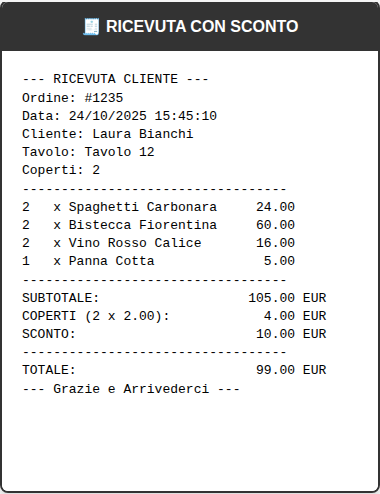

# How to Create an Order

This guide explains how to create orders in the RICEVUTE system for all scenarios: normal orders, staff orders, and orders with discounts.

## Quick Reference

| Order Type | Staff Checkbox | Discount Field | Total | Appears in Reports |
|------------|---------------|----------------|-------|-------------------|
| **Normal Order** | ❌ Unchecked | Optional (€0.00+) | Calculated from products | ✅ Yes |
| **Staff Order** | ✅ **CHECKED** | Disabled | **€0.00** (automatic) | ❌ No |
| **Order with Discount** | ❌ Unchecked | ✅ Enter amount | Subtotal - Discount | ✅ Yes |

## Table of Contents

1. [Overview](#overview)
2. [Accessing the Order Creation Page](#accessing-the-order-creation-page)
3. [Creating a Normal Order](#creating-a-normal-order)
4. [Creating a Staff Order](#creating-a-staff-order)
5. [Creating an Order with Discount](#creating-an-order-with-discount)
6. [Understanding the Receipt](#understanding-the-receipt)
7. [Tips and Best Practices](#tips-and-best-practices)

---

## Overview

The RICEVUTE system allows you to create three types of orders:

- **Normal Orders**: Standard customer orders that are included in daily reports and revenue calculations
- **Staff Orders**: Orders for staff members with zero cost, excluded from revenue reports
- **Orders with Discounts**: Customer orders with applied discounts (can be combined with normal orders)

All orders are created through the **Cassa (Cash Register)** page.

### Decision Tree: Which Order Type Do I Need?

```
Start Creating an Order
         |
         v
Is this for staff?  ──YES──> Use STAFF ORDER
         |                    (Check "Ordine Staff" box)
         NO
         |
         v
Does customer have  ──YES──> Use ORDER WITH DISCOUNT
a discount?                   (Enter discount amount)
         |
         NO
         |
         v
    Use NORMAL ORDER
    (Standard process)
```

---

## Accessing the Order Creation Page

1. **Login** to the RICEVUTE system
2. From the homepage, click on **"Cassa"** or navigate to `/public/cassa.php`
3. You will see the order creation interface


---

## Creating a Normal Order

A normal order is a standard customer order that contributes to your daily revenue and reports.

### Step-by-Step Instructions

#### Step 1: Enter Customer Information

1. **Nome Cliente (Customer Name)**: Enter the customer's name
   - Example: "Mario Rossi"
   - Default: "Cliente" if left empty

2. **Tavolo / Asporto (Table / Takeaway)**: Select a table or takeaway
   - Choose a table number from the dropdown (e.g., "Tavolo 1", "Tavolo 2")
   - Or select "Asporto / Ritiro" for takeaway orders
   - **Note**: When you select "ASPORTO", the number of covers is automatically set to 0

3. **Numero Coperti (Number of Covers)**: Enter the number of people
   - Minimum: 0
   - Maximum: 999
   - Default: 1
   - For takeaway orders, this is automatically set to 0

#### Step 2: Add Products

1. **Codice Prodotto (Product Code)**: Enter the product code
   - Example: "PIZZA001", "BEV001"
   - Press Enter or click "Aggiungi Prodotto"

2. **Quantità (Quantity)**: Specify how many items
   - Default: 1
   - You can modify this before adding the product

3. Click **"Aggiungi Prodotto"** button to add the item to the order

4. **Repeat** for all products the customer wants to order

#### Step 3: Review the Order

The right panel shows a summary of your order:

- **Riepilogo Comanda**: List of all products added
- **Subtotale**: Total before covers and discounts
- **Coperti**: Cover charge (if applicable)
- **Sconto**: Discount field (keep at 0.00 for normal orders)
- **TOTALE**: Final total amount

You can **remove** any product by clicking the ❌ icon next to it.

#### Step 4: Save and Print

1. Review all information is correct
2. Click **"Salva e Stampa Comande"** button
3. The system will:
   - Save the order to the database
   - Generate printed receipts for each department (Kitchen, Bar, etc.)
   - Generate a customer receipt
   - Display a success message

### Example: Normal Order

```
Customer: Mario Rossi
Table: Tavolo 5
Covers: 4

Products:
- 2x Pizza Margherita @ €8.50 = €17.00
- 4x Acqua Naturale @ €3.00 = €12.00

Subtotale: €29.00
Coperti: €8.00 (4 covers @ €2.00 each)
Sconto: €0.00
TOTALE: €37.00
```

---

## Creating a Staff Order

Staff orders are for restaurant employees and have special characteristics:
- The total is **automatically set to €0.00**
- They are **excluded from daily revenue reports**
- They are **excluded from product statistics**

### Step-by-Step Instructions

#### Step 1: Enter Staff Member Information

1. **Nome Cliente**: Enter the staff member's name
   - Example: "Giuseppe - Staff"

2. **Tavolo / Asporto**: Select a table or takeaway
   - Staff can eat at a table or take their meal away

3. **Numero Coperti**: Enter the number of staff members
   - This can be 1 or more

#### Step 2: Enable Staff Flag

**IMPORTANT**: Before adding products, check the **"Ordine Staff"** checkbox

- ✅ **Check** the box labeled: "Ordine Staff (totale a 0, escluso dai report)"
- This tells the system this is a staff order

**What happens when you check this box:**
- The discount field is disabled (staff orders cannot have additional discounts)
- The total will display as **€0.00** in green/bold
- The order will be marked as a staff order in the database

#### Step 3: Add Products

1. Add products the same way as a normal order
2. Enter product codes and quantities
3. Notice that the **TOTALE** remains at **€0.00** even as you add products

#### Step 4: Save and Print

1. Click **"Salva e Stampa Comande"**
2. The system will:
   - Save the order with `Staff = true`
   - Set the total to €0.00 in the database
   - Generate kitchen/bar receipts (so staff meals are still prepared)
   - Mark this order as excluded from revenue reports

### Example: Staff Order

```
Customer: Giuseppe - Staff
Table: Tavolo 12
Covers: 1
✅ Ordine Staff: CHECKED

Products:
- 1x Pizza Margherita @ €8.50
- 1x Coca Cola @ €3.00

Subtotale: Shows product list
Sconto: DISABLED (grayed out)
TOTALE: €0.00 (in green/bold)
```

### Important Notes about Staff Orders

- ⚠️ **The checkbox must be checked BEFORE saving**
- ⚠️ Staff orders **do not appear** in daily revenue reports
- ⚠️ Staff orders **do not count** towards product sales statistics
- ✅ Staff orders **are still printed** to kitchen/bar for preparation
- ✅ Staff orders **are stored** in the database for audit purposes

---

## Creating an Order with Discount

You can apply a discount to any normal customer order. Discounts reduce the final total and are shown on receipts.

### Step-by-Step Instructions

#### Step 1: Create the Order Normally

1. Enter customer information
2. Select table or takeaway
3. Enter number of covers
4. Add all products to the order

#### Step 2: Apply the Discount

1. In the order summary panel, find the **"Sconto"** field
2. Enter the discount amount in euros
   - Example: `5.00` for a €5 discount
   - Example: `10.50` for a €10.50 discount

3. **The total updates automatically**:
   ```
   TOTALE = Subtotale + Coperti - Sconto
   ```

#### Step 3: Save and Print

1. Click **"Salva e Stampa Comande"**
2. The receipt will show:
   - Subtotale (price before discount)
   - Sconto (discount amount)
   - Totale (final price after discount)

### Example: Order with Discount

```
Customer: Maria Bianchi
Table: Tavolo 3
Covers: 2

Products:
- 2x Pizza Margherita @ €8.50 = €17.00
- 2x Tiramisu @ €5.00 = €10.00
- 2x Vino Rosso @ €6.00 = €12.00

Subtotale: €39.00
Coperti: €4.00 (2 covers @ €2.00 each)
Sconto: €5.00 ← DISCOUNT APPLIED
TOTALE: €38.00
```

### Discount Rules

- ✅ Discounts can be any amount from €0.00 to €999,999.99
- ✅ If discount exceeds subtotal, the total is set to €0.00 (minimum)
- ✅ Discounts are saved in the database separately from the total
- ✅ Discounts appear on printed receipts
- ❌ Staff orders **cannot** have additional discounts (discount field is disabled)

### Receipt Display

When a discount is applied, the receipt shows:

```
=====================================
         RICEVUTA CLIENTE
=====================================

Cliente: Maria Bianchi
Tavolo: Tavolo 3
Coperti: 2

-------------------------------------
2x Pizza Margherita     €17.00
2x Tiramisu             €10.00
2x Vino Rosso           €12.00
-------------------------------------

SUBTOTALE:              €39.00
COPERTI:                 €4.00
SCONTO:                  €5.00
=====================================
TOTALE:                 €38.00
=====================================
```

---

## Understanding the Receipt

When you save an order, the system generates multiple receipts:

### 1. Customer Receipt (Ricevuta Cliente)

Shows:
- Customer name and table
- Number of covers
- All products ordered
- Subtotal, covers, discount (if any)
- **Final total**


### 2. Department Receipts (Comande)

Separate receipts for each department:
- **Kitchen Receipt**: All food items
- **Bar Receipt**: All beverages
- **Other departments** as configured


### Receipt with Discount

When a discount is applied, it appears on the customer receipt:



---

## Tips and Best Practices

### For Normal Orders

- ✅ **Double-check** the table number before saving
- ✅ **Verify** the number of covers matches the party size
- ✅ **Review** all products before clicking "Salva e Stampa"
- ✅ Use the **remove button (❌)** to delete incorrect items
- ✅ The customer receipt shows all details for verification

### For Staff Orders

- ⚠️ **ALWAYS** check the "Ordine Staff" checkbox FIRST
- ⚠️ Verify the total shows **€0.00 in green** before saving
- ✅ Use clear names like "Giuseppe - Staff" to identify staff orders
- ✅ Staff orders still print to kitchen/bar for meal preparation
- ℹ️ Remember: Staff orders won't appear in your daily revenue reports

### For Discounts

- ✅ Enter discount amounts carefully (they cannot be changed after saving)
- ✅ Common discounts: loyalty cards, promotions, VIP customers
- ✅ The receipt clearly shows the discount to the customer
- ⚠️ Large discounts should be verified by management
- ℹ️ Discounts are tracked separately for reporting purposes

### General Tips

- 🔄 **Start fresh**: After saving an order, the form automatically resets for the next customer
- 🖨️ **Check printer**: Ensure receipt printers are working before busy periods
- 📊 **Review reports**: Use the Reports page to verify daily sales
- 💾 **Database**: All orders are permanently saved in the database
- 🔒 **Security**: Only authorized users should access the Cassa page

### Keyboard Shortcuts

- **Tab**: Move between fields quickly
- **Enter**: In product code field, adds the product to the order
- **ESC**: Clear the current input field

### Common Scenarios

#### Scenario: Customer Changes Their Mind

If a customer wants to modify their order **before saving**:
1. Click the ❌ button next to the item to remove it
2. Add the correct item
3. Then save the order

#### Scenario: Wrong Table Selected

If you selected the wrong table **before saving**:
1. Simply change the table selection in the dropdown
2. All other information remains unchanged
3. Save the order

#### Scenario: Takeaway Order

For takeaway orders:
1. Select "Asporto / Ritiro" as the table
2. Covers automatically set to 0
3. Add products normally
4. Save and print

#### Scenario: Large Party with Discount

For a large party with a promotional discount:
1. Enter all customer information and covers
2. Add all products
3. Apply the promotional discount amount
4. Verify the total is correct
5. Save and print

#### Scenario: Multiple Staff Members Eating Together

For multiple staff members:
1. Check "Ordine Staff" checkbox
2. Enter "Staff Group" or similar in customer name
3. Set covers to the number of staff members
4. Add all products
5. Verify total is €0.00
6. Save and print

---

## Troubleshooting

### Problem: Cannot Add Products

**Solution**: Ensure you've entered a valid product code. Product codes must exist in the system.

### Problem: Total Not Updating

**Solution**: Refresh the page and try again. Ensure JavaScript is enabled in your browser.

### Problem: Staff Order Showing Price

**Solution**: Make sure you checked the "Ordine Staff" checkbox. If the total is not €0.00, the checkbox was not checked.

### Problem: Discount Not Applied

**Solution**: Enter the discount amount in the "Sconto" field before saving. You cannot modify discounts after saving.

### Problem: Receipt Not Printing

**Solution**: 
1. Check that receipt printers are connected and powered on
2. Verify printer configuration in Admin panel
3. Contact system administrator if issue persists

---

## Related Documentation

- [API Documentation](../docs/API.md) - Technical details about the order API
- [Staff Flag Feature](../docs/STAFF_FLAG_FEATURE.md) - Technical implementation of staff orders
- [Discount Field Implementation](../docs/DISCOUNT_FIELD_IMPLEMENTATION.md) - Technical implementation of discounts

---

## Need Help?

If you encounter issues or have questions:

1. Check this guide first
2. Review the [screenshots](../docs/screenshots/) for visual reference
3. Consult your system administrator
4. Open an issue on GitHub for technical problems

---

*Last updated: October 2024*
